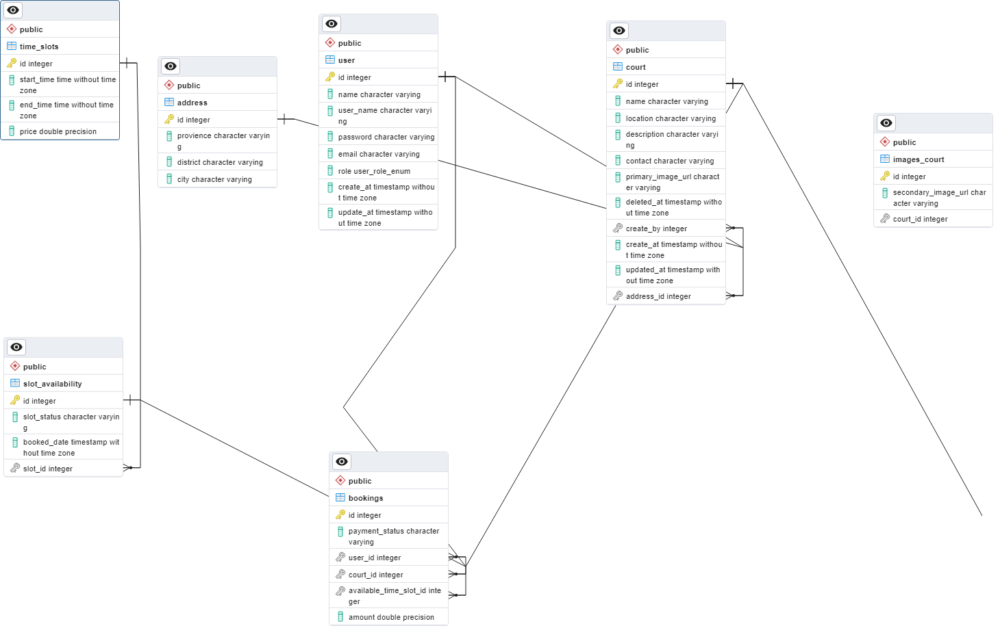

## Futsal managaemnet system

```

    .............................
    .       Users               .
    .............................
    .  -id                      .
    .  -username                .
    .  -email                   .
    .  -password                .
    .............................

    .............................
    .       Roles               .
    .............................
    .  -id                      .
    .  -name                    .
    .............................


    .............................
    .       User_role           .
    .............................
    .  -user_id                 .
    .  -role_id                 .
    .............................

    .............................
    .       address             .
    .............................
    .  -id                      .
    .  -provience               .
    .  -district                .
    .  -city                    .
    .............................


    .............................
    .       pre_time_slots      .
    .............................
    .  -id                      .
    .  -start_time              .
    .  -end_time                .
    .  -price                   .
    .............................


    .............................
    .       time_slots          .
    .............................
    .  -id                      .
    .  -pre_slot_id             .
    .  -slot_status             .
    .  -date                    .
    .............................


    .............................
    .       courts               .
    .............................
    .  -id                      .
    .  -name                    .
    .  -features                .
    .  -contact                 .
    .   -image                  .
    .   -address_id             .
    .............................


    .............................
    .       bookings             .
    .............................
    .  -id                      .
    .  -user_id                 .
    .  -court_id                .
    .  -slot_id                 .
    . -payment_status           .
    .   -amount_pay             .
    .............................
```


[Database]